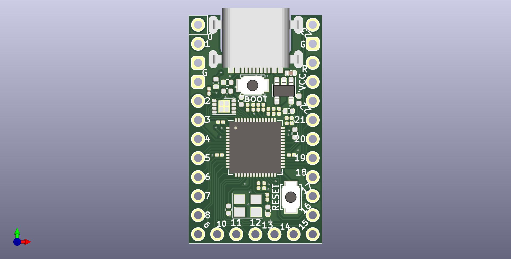

# EnvOpenPico
A Raspberry Pi RP2040 based board in the shape of an Elite-C.

### Info
This board is about 2.5mm shorter than an Elite-C and uses a mid-mount USB C port.

### some notes
I dont update the readme very often so some info here may end up outdated at some point.