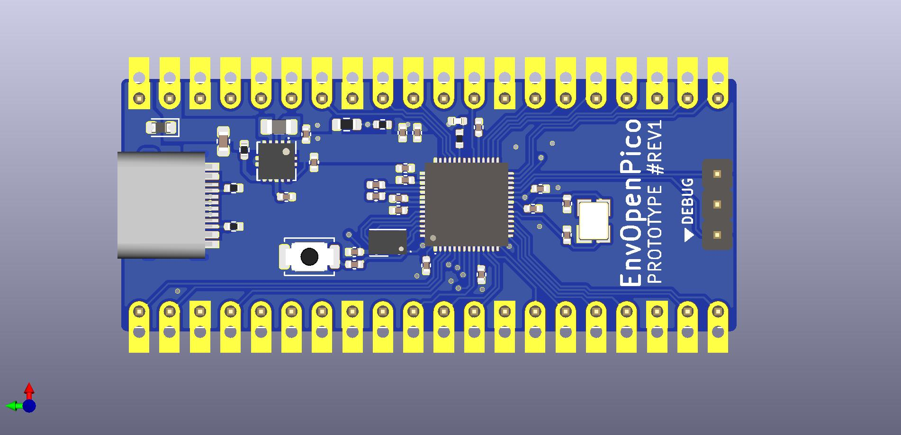

# EnvOpenPico
A Raspberry Pi Pico Clone which also uses the RP2040.

### Info
This board is meant to be a mostly drop in replacement for the pico plus and minus some features.

### some notes
I dont update the readme very often so some info here may end up outdated at some point