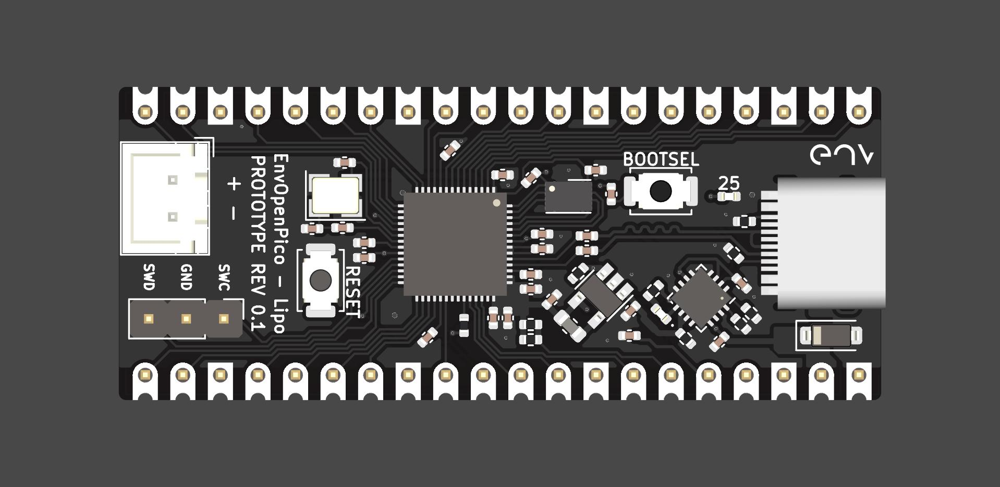

# EnvOpenPico
A Raspberry Pi Pico Clone which also uses the RP2040.

## THIS PROJECT IS FOR KICAD 5.99
because there are a couple features of kicad 5.99 that I need this project will be done in kicad 5.99 instead of kicad stable.

### Info
This version of the board uses a PMIC namely BQ24072RGT this is paired with a LM3671MF 3.3V to get the rpi pico its 3.3V, there is also a ESP32-PICO-D4 for wifi and bluetooth and maybe later it can be used as an IO expander.

### problems
I must point out that alike most things on my github im learning as I go so some pointers on doing things correctly would be apreciated.