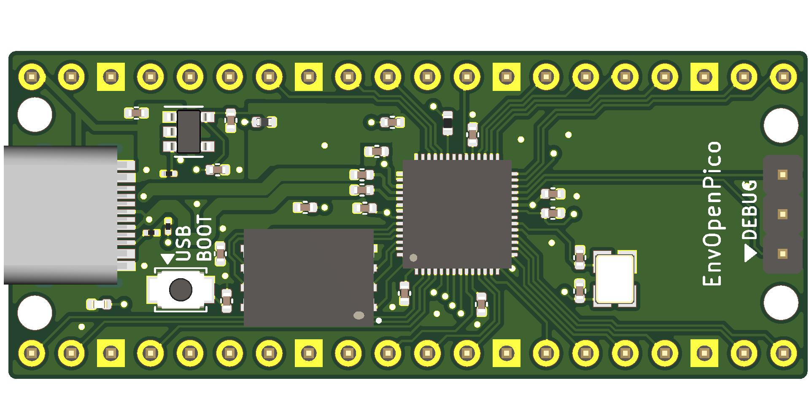

# EnvOpenPico
 A RP2040 based board that fits in place of a Raspberry pi pico

### Intentions
I'd like to design a RP2040 based MCU board that fits in place of a raspberry pi pico, so far most I have managed to replicate most of the pins with the exception of a couple i.e VSYS, ADC_VREF

### I need help!
Sure I know how to throw together a Keyboard that uses the Pi Pico in KiCad but that doesnt translate to being able to design a microcontroller board.

### extra notes
I'd like to use JLCPCB so if you do wish to contribute I would highly apreciate if we can have most if not the whole board pre-assembled by JLCPCB. (other than the 2.54mm pins of course)

DO NOTE that if you want one of these for your self some manual assembly is required, JLCPCB obviously doesnt stock RP2040s nor the flash chip or the usb boot button, they do however stock most generic parts i.e 0402 diodes, 0201 caps/resistors and etc.
(btw the button is a Omron B3U, I think I forgot to add that to the Schematic as of writing this)

### To Do's 
- [x] ~~move all SMD components to top side of PCB~~
- [x] ~~Smaller Crystal chip~~
- [x] ~~Want to replace Quad SPI flash with a smaller one~~
- [x] ~A small button instead of pin headers for USB Boot would be great.~~
- [ ] Need someone probably port circuitpython to this, QMK would be a huge bonus since I'd love to use this with my keyboards.
- - I think porting circuitpython may be the easiest since other RP2040 boards use similar winbond flash chips

#### Me?
I need to learn how to do smd soldering type stuff so I can test this.
but if you order this for your self, let me know how it goes and what doesnt work in reality that does on "paper".