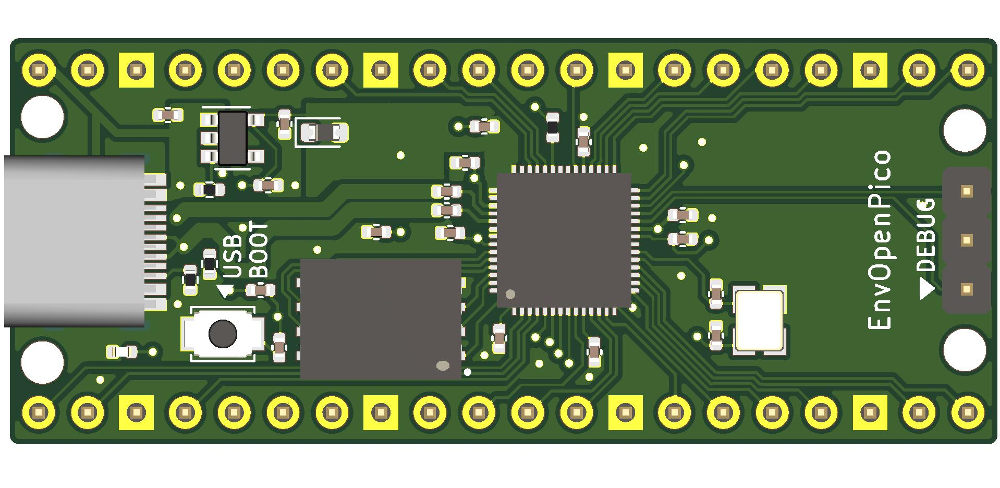

# EnvOpenPico
 A RP2040 based board that fits in place of a Raspberry pi pico

### Intentions
I'd like to design a RP2040 based MCU board that fits in place of a raspberry pi pico, the pinout will be the same but a couple things will change i.e there will be space left about to change the USB port for a Type-C, JST connector or even just 2.54mm pitch pins. (maybe with some smart design we can fit all of these on the board.)

### I need help!
Sure I know how to throw together a Keyboard that uses the Pi Pico in KiCad but that doesnt translate to being able to design a microcontroller board.

### extra notes
I'd like to use JLCPCB so if you do wish to contribute I would highly apreciate if we can have most if not the whole board pre-assembled by JLCPCB. (other than the 2.54mm pins of course)

### To Do's 
* move all SMD components to top side of PCB
* Find smaller alternatives to Crystal and SPI Flash

