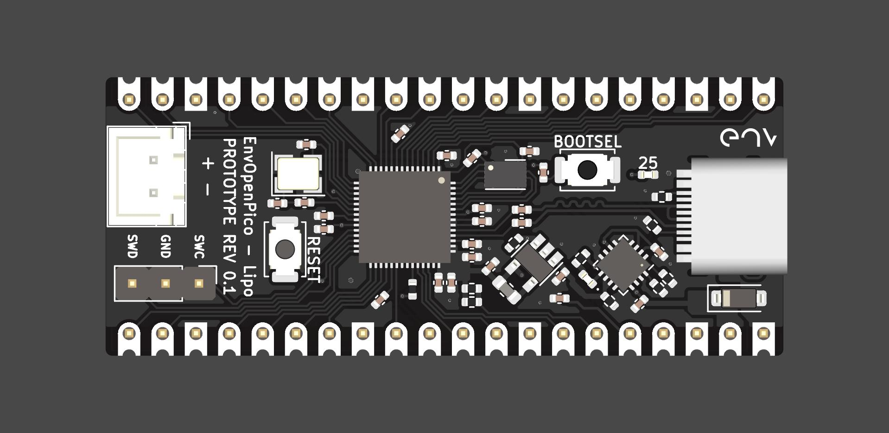

# EnvOpenPico
A Raspberry Pi Pico Clone which also uses the RP2040.

### Info
A pi pico clone with a battery charge and protect IC.

originally this was going to be a version that contains a battery charge IC and a ESP32 wireless slave but I feel like its a bad idea to combine things Ive not worked on before so I scaled back the project to have just a battery PMIC.

### problems
I must point out that alike most things on my github im learning as I go so some pointers on doing things correctly would be apreciated.